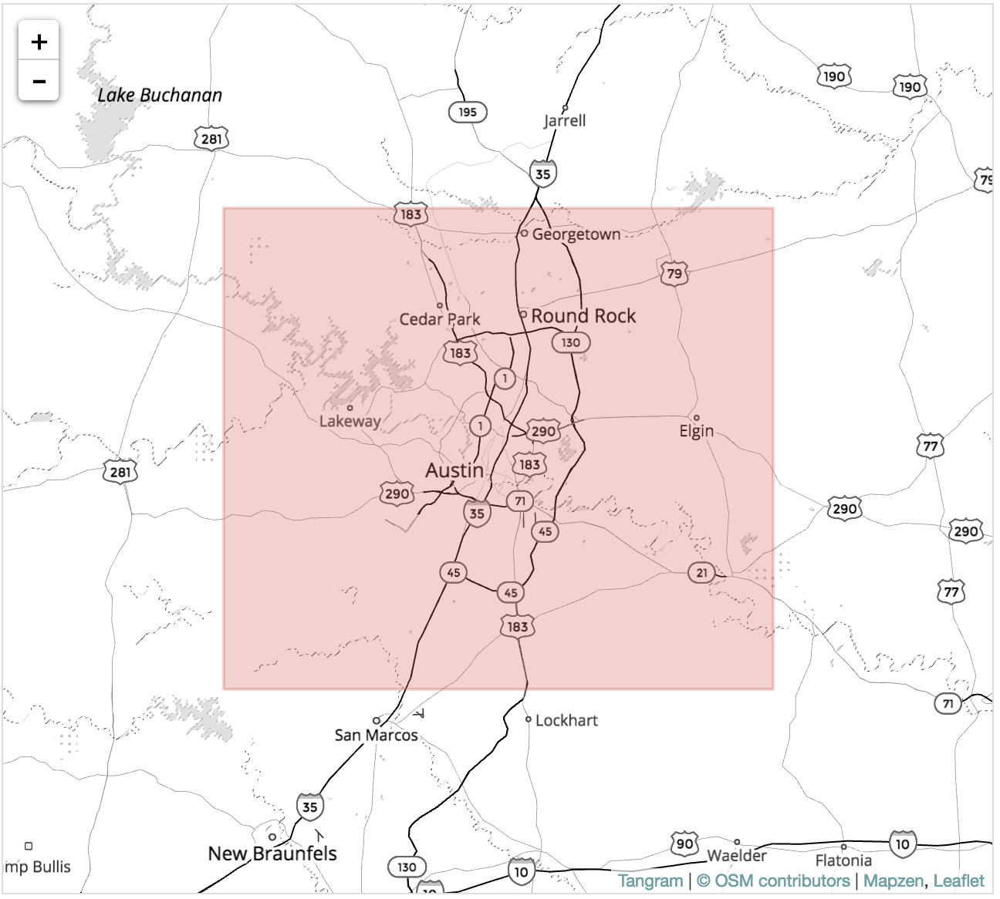

# Wrangling Open Street Map data with MongoDB

## Map Area
#### Austin, TX, United States
https://mapzen.com/data/metro-extracts/metro/austin_texas/

https://www.openstreetmap.org/relation/113314

Austin is where I did my first internship so it is special to me. I am also familiar with the street names so I will be able to audit it better. I downloaded osm file from mapzen.com which consisted of data from the shaded area in the map below. It is over 1.4 GB(uncompressed)



## Auditing the data

Due to the huge size of the data, I will load a smaller section of data as a sample. 


```python
import xml.etree.ElementTree as ET
import pprint
from collections import defaultdict
import re
```


```python
OSM_FILE = "austin_texas.osm"
SAMPLE_FILE = "sample.osm"
```


```python
k = 10

def get_element(osm_file, tags=('node', 'way', 'relation')):
    """Yield element if it is the right type of tag Reference: http://stackoverflow.com/questions/
    3095434/inserting-newlines-in-xml-file-generated-via-xml-etree-elementtree-in-python
    """
    context = iter(ET.iterparse(osm_file, events=('start', 'end')))
    _, root = next(context)
    for event, elem in context:
        if event == 'end' and elem.tag in tags:
            yield elem
            root.clear()


with open(SAMPLE_FILE, 'wb') as output:
    output.write('<?xml version="1.0" encoding="UTF-8"?>\n')
    output.write('<osm>\n  ')

    # Write every kth top level element
    for i, element in enumerate(get_element(OSM_FILE)):
        if i % k == 0:
            output.write(ET.tostring(element, encoding='utf-8'))

    output.write('</osm>')
```

After loading the sample data, lets parse one tag at a time with ElementTree and count the number of top level tags. Iterative parsing is utilized for this as data is too large to process on the complete document


```python
def count_tags(filename):
    """count tags in filename.
    
    Init 1 in dict if the key not exist, increment otherwise."""
    tags = {}
    for ev, elem in ET.iterparse(filename):
        tag = elem.tag
        if tag not in tags.keys():
            tags[tag] = 1
        else:
            tags[tag] += 1
    return tags


tags = count_tags(OSM_FILE)
pprint.pprint(tags)
```

    {'bounds': 1,
     'member': 20369,
     'nd': 7020265,
     'node': 6386286,
     'osm': 1,
     'relation': 2396,
     'tag': 2387514,
     'way': 669483}


Next, Let us explore the data some more to check for potential problems in the data. I have created regular expressions to check for certain patterns in the tag "k=addr:", the function 'key_type' will count of each of the four tag categories in a dictionary:
  "lower", for tags that contain only lowercase letters and are valid,
  "lower_colon", for otherwise valid tags with a colon in their names,
  "problemchars", for tags with problematic characters, and
  "other", for other tags that do not fall into the other three categories.


```python
lower = re.compile(r'^([a-z]|_)*$')
lower_colon = re.compile(r'^([a-z]|_)*:([a-z]|_)*$')
problemchars = re.compile(r'[=\+/&<>;\'"\?%#$@\,\. \t\r\n]')


def key_type(element, keys):
    if element.tag == "tag":
        for tag in element.iter('tag'):
            k = tag.get('k')
            if lower.search(k):
                keys['lower'] += 1
            elif lower_colon.search(k):
                keys['lower_colon'] += 1
            elif problemchars.search(k):
                keys['problemchars'] += 1
            else:
                keys['other'] += 1
    return keys


def process_map(filename):
    keys = {"lower": 0, "lower_colon": 0, "problemchars": 0, "other": 0}
    for _, element in ET.iterparse(filename):
        keys = key_type(element, keys)
    return keys


keys = process_map(OSM_FILE)
pprint.pprint(keys)
```

    {'lower': 1307962, 'lower_colon': 1067521, 'other': 12030, 'problemchars': 1}


Next, let's now find out how many unique users have contributed to the map in this osm, following code gives us 1260 different unique users who have contributed to the street map


```python
def process_map_users(filename):
    users = set()
    for _, element in ET.iterparse(filename):
        for e in element:
            if 'uid' in e.attrib:
                users.add(e.attrib['uid'])

    return users


users = process_map_users(OSM_FILE)
len(users)
```


    1260


## Auditing Street Names

The first step is to create a set of expected values for the street names. The next function is a regex to match the last token in a string optionally ending with a period


```python
street_type_reg = re.compile(r'\b\S+\.?$', re.IGNORECASE)

expected_street_types = ["Avenue", "Boulevard", "Commons", "Court",
                         "Drive","Lane", "Parkway", "Place", "Road",
                         "Square", "Street", "Trail", "Way", "Vista",
                         "Terrace","Trace","Valley", "View", "Walk",
                         "Run","Ridge","Row","Point","Plaza","Path",
                         "Pass","Park","Overlook","Meadows","Loop",
                         "Hollow","Hill","Highway","Expressway","Cove",
                         "Crossing","Creek","Circle","Canyon","Bend"]
```

The next function: audit_street_type will search for the above regex , If there is a match and it's not in our list of expected street types, it will add the street_name to the street_type dictionary.


```python
def audit_street_type(street_types, street_name,
                      regex, expected_street_types):
    m = regex.search(street_name)
    if m:
        street_type = m.group()
        if street_type not in expected_street_types:
            street_types[street_type].add(street_name)
```

The function is_street_name determines if an element contains an attribute k="addr:street" and returns it


```python
def is_street_name(elem):
    return (elem.attrib['k'] == "addr:street")
```

Finally, an audit function to iterate over way and node tags to print out all the various street types found in the data set


```python
def audit(osmfile, regex):
    osm_file = open(osmfile, "r")
    street_types = defaultdict(set)

    # iteratively parse the mapping xml
    for event, elem in ET.iterparse(osm_file, events=("start",)):
        # iterate 'tag' tags within 'node' and 'way' tags
        if elem.tag == "node" or elem.tag == "way":
            for tag in elem.iter("tag"):
                if is_street_name(tag):
                    audit_street_type(street_types, tag.attrib['v'],
                                      regex, expected_street_types)

    return street_types
```

Let us print some of the street types now using pprint and depth=5 as it is a very long list


```python
street_types = audit(OSM_FILE, street_type_reg)
pprint.pprint(dict(street_types), depth = 10)
```

    {'100': set(['Avery Ranch Blvd Building A #100',
                 'Jollyville Road Suite 100',
                 'Old Jollyville Road, Suite 100',
                 'RM 2222 Unit #100']),
     '101': set(['4207 James Casey st #101']),
     '104': set(['11410 Century Oaks Terrace Suite #104', 'S 1st St, Suite 104']),
     '1100': set(['Farm-to-Market Road 1100']),
     '117': set(['County Road 117']),
     '12': set(['Ranch to Market Road 12']),
     '120': set(['Building B Suite 120']),
     '129': set(['County Road 129']),
     '130': set(['Highway 130']),
     '1327': set(['FM 1327', 'Farm-to-Market Road 1327']),
     '138': set(['County Road 138']),
     '140': set(['S IH 35 Frontage Rd #140']),
     '1431': set(['Farm-to-Market Road 1431', 'Old Farm-to-Market 1431']),
     '150': set(['Farm-to-Market Road 150',
                 'IH-35 South, #150',
                 'Metric Boulevard #150',
                 'Ranch-to-Market Road 150']),
     '1625': set(['Farm-to-Market Road 1625']),
     '1626': set(['F.M. 1626', 'FM 1626', 'Farm-to-Market Road 1626']),
     '163': set(['Bee Cave Road Suite 163']),
     '170': set(['County Road 170']),
     '1805': set(['N Interstate 35, Suite 1805']),
     '1825': set(['FM 1825']),
     '1826': set(['Farm To Market Road 1826', 'Ranch to Market Road 1826']),
     '183': set(['Highway 183',
                 'N HWY 183',
                 'U.S. 183',
                 'US 183',
                 'US Highway 183',
                 'United States Highway 183']),
     '1869': set(['Ranch-to-Market Road 1869']),
     '2': set(['6800 Burnet Rd #2']),
     '200N': set(['Burnet Road #200N']),
     '203': set(['West Ben White Boulevard #203',
                 'West Ben White Boulevard, #203']),
     '213': set(['Executive Center Drive Suite 213']),
     '2222': set(['Ranch to Market Road 2222']),
     '2243': set(['Old FM 2243']),
     '2244': set(['RM 2244']),
     '260': set(['S Interstate 35, #260']),
     '2769': set(['Farm-to-Market Road 2769']),
     '280': set(['County Road 280']),
     '290': set(['C R 290',
                 'County Road 290',
                 'E Hwy 290',
                 'East Highway 290',
                 '


<b>limit_output extension: Maximum message size of 2000 exceeded with 18552 characters</b>


## Problems in Data Set

1) First Problem I noticed is abbreviated street types ex St for Street, Ct for Court, Ave for Avenue etc. Next function will be for mapping these to their unabbreviated form so they are consistent and standardized, I will also standardize N,E,W,S to North, East, West, South


```python
def update(name, mapping): 
    words = name.split()
    for w in range(len(words)):
        if words[w] in mapping:
            if words[w].lower() not in ['suite', 'ste.', 'ste']: 
                # For example, don't update 'Suite E' to 'Suite East'
                words[w] = mapping[words[w]] 
                name = " ".join(words)
    return name
```


```python
street_type_mapping = {'Ave':'Avenue','Ave.':'Avenue','Avene':'Avenue',
                       'Blvd' : 'Boulevard','Blvd.' : 'Boulevard',
                       'Cv' : 'Cove',
                       'Dr'   : 'Drive','Dr.' : 'Drive', 
                       'hwy':'Highway','Hwy':'Highway','HWY':'Highway',
                       'Ln' : 'Lane',
                       'Pkwy' : 'Parkway',
                       'Rd'   : 'Road',
                       'St':'Street','St.':'Street','street':'Street',
                       'Ovlk' : 'Overlook',
                       'way': 'Way',
                       'N' : 'North','N.': 'North',
                       'S' : 'South','S.': 'South',
                       'E' : 'East','E.': 'East',
                       'W': 'West','W.': 'West',
                       'IH35':'Interstate Highway 35',
                       'IH 35':'Interstate Highway 35',
                       'I 35':'Interstate Highway 35',
                       'I-35':'Interstate Highway 35'}
```

let us search street types again and replace abbreviations with full standardized street types


```python
for street_type, ways in street_types.iteritems():
    for name in ways:
        better_name = update(name, street_type_mapping)
        print name, "=>", better_name
```

    Merimac => Merimac
    Clara Van => Clara Van
    Capri => Capri
    Chelsea Moor => Chelsea Moor
    Royal Birkdale Ovlk => Royal Birkdale Overlook
    Apache => Apache
    Farm-to-Market Road 812 => Farm-to-Market Road 812
    Bee Cave Road Suite 163 => Bee Cave Road Suite 163
    Adventurer => Adventurer
    Affirmed => Affirmed
    West 35th Street Cutoff => West 35th Street Cutoff
    Ferguson Cutoff => Ferguson Cutoff
    House Wren => House Wren
    N I-35 Suite 298 => North Interstate Highway 35 Suite 298
    Melody => Melody
    East Highway 290 => East Highway 290
    Highway 290 => Highway 290
    W. Highway 290 => West Highway 290
    East Hwy 290 => East Highway 290
    C R 290 => C R 290
    West Highway 290 => West Highway 290
    W Hwy 290 => West Highway 290
    U.S. 290 => U.S. 290
    West US Highway 290 => West US Highway 290
    E Hwy 290 => East Highway 290
    US Highway 290 => US Highway 290
    County Road 290 => County Road 290
    W HWY 290 => West Highway 290
    Helios Way, Bldg 2, Suite 290 => Helios Way, Bldg 2, Suite 290
    US 290 => US 290
    Pony Chase => Pony Chase
    Pecan Chase => Pecan Chase
    Mustang Chase => Mustang Chase
    Glen Rose Chase => Glen Rose Chase
    Shetland Chase => Shetland Chase
    Wild Basin Lodge => Wild Basin Lodge
    Palm Harborway => Palm Harborway
    south church street => south church Street
    East main street => East main Street
    South 1st street => South 1st Street
    White House street => White House Street
    Carlos G Parker Boulevard Northwest => Carlos G Parker Boulevard Northwest
    Raven Caw pass => Raven Caw pass
    Applegate Drive East => Applegate Drive East
    Mockingbird Lane East => Mockingbird Lane East
    Alpine Road East => Alpine Road East
    Brenham Street East => Brenham Street East
    Basin Ledge East => Basin Ledge East
    Hwy 290 East => Highway 290 East
    Ledgeway East => Ledgeway East
    Main Street East => Main Street East
    Black Locust Drive East => Black Locust Drive East
    Rutland Village East => Rutland Village East
    US 290 East => US 290 East
    Covington Drive East => Covington Drive East
    Colorado Drive East => Colorado Drive East
    Cypress Point East


<b>limit_output extension: Maximum message size of 2000 exceeded with 11523 characters</b>


As seen above the mapping has been applied correctly to give full forms for cardinal directions and Ln, Dr, etc. Also updated IH-35/I-35 etc to 'Interstate Highway 35'(major highway in austin connecting San Antonio and Dallas)

2) For Postal Codes I used a similar approach as in the Street Name Cleaning. I converted them to standard 5 digit postal codes


```python
zip_type_re = re.compile(r'\b\S+\.?$', re.IGNORECASE)
zip_types = defaultdict(set)
expected_zip = ["73301","73344","76574","78602","78610","78612",
                "78613","78615","78616","78617","78619","78620",
                "78621","78626","78628","78634","78640","78641",
                "78642","78644","78645","78646","78652","78653",
                "78654","78656","78660","78663","78664","78665",
                "78666","78669","78676","78680","78681","78682",
                "78691","78701","78702","78703","78704","78705",
                "78712","78717","78719","78721","78722","78723",
                "78724","78725","78726","78727","78728","78729",
                "78730","78731","78732","78733","78734","78735",
                "78736","78737","78738","78739","78741","78742",
                "78744","78745","78746","78747","78748","78749",
                "78750","78751","78752","78753","78754","78756",
                "78757","78758","78759","78957"]
def audit_zip_codes(zip_types, zip_name, regex, expected_zip):
    m = regex.search(zip_name)
    if m:
        zip_type = m.group()
        if zip_type not in expected_zip:
             zip_types[zip_type].add(zip_name)
def is_zip_name(elem):
    return (elem.attrib['k'] == "addr:postcode")
def audit(filename, regex):
    for event, elem in ET.iterparse(filename, events=("start",)):
        if elem.tag == "way" or elem.tag == "node":
            for tag in elem.iter("tag"):
                if is_zip_name(tag):
                    audit_zip_codes(zip_types, tag.attrib['v'], 
                                    regex, expected_zip)
    return zip_types
```


```python
audit(OSM_FILE, zip_type_re)
pprint.pprint(dict(zip_types))
```

    {'76574-4649': set(['76574-4649']),
     '78613-2277': set(['78613-2277']),
     u'78626\u200e': set([u'78626\u200e']),
     '78640-4520': set(['78640-4520']),
     '78640-6137': set(['78640-6137']),
     '78704-5639': set(['78704-5639']),
     '78704-7205': set(['78704-7205']),
     '78724-1199': set(['78724-1199']),
     '78728-1275': set(['78728-1275']),
     '78753-4150': set(['78753-4150']),
     '78754-5701': set(['78754-5701']),
     '78758-7008': set(['78758-7008']),
     '78758-7013': set(['78758-7013']),
     '78759-3504': set(['78759-3504']),
     'Texas': set(['Texas']),
     'tx': set(['tx'])}


To standardize the zipcodes, I will keep the first 5 digits in the postal code and drop the digits after the hyphen.


```python
def update_zip(postcode):
    return postcode.split("-")[0]
```


```python
for zip_type, ways in zip_types.iteritems():
    for postal in ways:
        better_zip = update_zip(postal)
        print postal, "=>", better_zip
```

    78759-3504 => 78759
    tx => tx
    78626‎ => 78626‎
    78613-2277 => 78613
    76574-4649 => 76574
    78754-5701 => 78754
    78724-1199 => 78724
    78704-7205 => 78704
    Texas => Texas
    78758-7008 => 78758
    78728-1275 => 78728
    78753-4150 => 78753
    78640-4520 => 78640
    78758-7013 => 78758
    78640-6137 => 78640
    78704-5639 => 78704


## Preparing for Mongo DB


```python
from datetime import datetime as dt

CREATED = ["version", "changeset", "timestamp", "user", "uid"]

def shape_element(element):
    node = {}    
    if element.tag == "node" or element.tag == "way" :
        node['type'] = element.tag

        # Parse attributes
        for attrib in element.attrib:

            # Data creation details
            if attrib in CREATED:
                if 'created' not in node:
                    node['created'] = {}
                if attrib == 'timestamp':
                    node['created'][attrib] = dt.strptime(element.attrib[attrib], 
                                                                '%Y-%m-%dT%H:%M:%SZ')
                else:
                    node['created'][attrib] = element.get(attrib)

            # Parse location
            if attrib in ['lat', 'lon']:
                lat = float(element.attrib.get('lat'))
                lon = float(element.attrib.get('lon'))
                node['pos'] = [lat, lon]

            # Parse the rest of attributes
            else:
                node[attrib] = element.attrib.get(attrib)

        # Process tags
        for tag in element.iter('tag'):
            key   = tag.attrib['k']
            value = tag.attrib['v']
            if not problemchars.search(key):

                # Tags with single colon and beginning with addr
                if lower_colon.search(key) and key.find('addr') == 0:
                    if 'address' not in node:
                        node['address'] = {}
                    sub_attr = key.split(':')[1]
                    if is_street_name(tag):
                        # Do some cleaning
                        better_name = update(tag.attrib['v'],
                        street_type_mapping)
                        node['address'][sub_attr] = better_name
                    if key == 'postcode' or key == 'addr:postcode':
                        node['address'][sub_attr]=update_zip(tag.attrib['v'])
                    else:    
                        node['address'][sub_attr] = value
                

                # All other tags that don't begin with "addr"
                elif not key.find('addr') == 0:
                    if key not in node:
                        node[key] = value
                else:
                    node["tag:" + key] = value

        # Process nodes
        for nd in element.iter('nd'):
            if 'node_refs' not in node:
                node['node_refs'] = []
            node['node_refs'].append(nd.attrib['ref'])

        return node
    else:
        return None
```

#### Write JSON file


```python
lower = re.compile(r'^([a-z]|_)*$')
lower_colon = re.compile(r'^([a-z]|_)*:([a-z]|_)*$')
problemchars = re.compile(r'[=\+/&<>;\'"\?%#$@\,\. \t\r\n]')

import json
from bson import json_util

def process_map(file_in, pretty = False):
    file_out = "{0}.json".format(file_in)    
    with open(file_out, "wb") as fo:
        for _, element in ET.iterparse(file_in):
            el = shape_element(element)
            if el:
                if pretty:
                    fo.write(json.dumps(el, indent=2,
                                        default=json_util.default)+"\n")
                else:
                    fo.write(json.dumps(el,default=json_util.default)+"\n")

process_map(OSM_FILE)
```

## Overview of the Data


```python
import os
print 'The downloaded file is {} MB'.format(os.path.getsize(OSM_FILE)
                                            /1.0e6) 
# convert from bytes to megabytes
```

    The downloaded file is 1414.558803 MB


```python
print 'The json file is {} MB'.format(os.path.getsize(OSM_FILE + ".json")
                                      /1.0e6) 
# convert from bytes to megabytes
```

    The json file is 2543.250995 MB


#### Number of Street Addresses


```python
osm_file = open(OSM_FILE, "r")
address_count = 0

for event, elem in ET.iterparse(osm_file, events=("start",)):
    if elem.tag == "node" or elem.tag == "way":
        for tag in elem.iter("tag"): 
            if is_street_name(tag):
                address_count += 1

address_count
```


    326698


## Working with MongoDB


```python
import signal
import subprocess

# The os.setsid() is passed in the argument preexec_fn so
# it's run after the fork() and before  exec() to run the shell.
pro = subprocess.Popen('mongod', preexec_fn = os.setsid)
```

#### Connect to database with PyMongo


```python
from pymongo import MongoClient

db_name = 'openstreetmap'

# Connect to Mongo DB
client = MongoClient('localhost:27017')
# Database 'openstreetmap' will be created if it does not exist.
db = client[db_name]
```

#### Import data set


```python
# Build mongoimport command
collection = OSM_FILE[:OSM_FILE.find('.')]
working_directory = '/Users/tarunparmar/Nonu/'
json_file = OSM_FILE + '.json'

mongoimport_cmd = 'mongoimport -h 127.0.0.1:27017 ' + \
                  '--db ' + db_name + \
                  ' --collection ' + collection + \
                  ' --file ' + working_directory + json_file

# Before importing, drop collection if it exists (i.e. a re-run)
if collection in db.collection_names():
    print 'Dropping collection: ' + collection
    db[collection].drop()

# Execute the command
print 'Executing: ' + mongoimport_cmd
subprocess.call(mongoimport_cmd.split())
```

    Executing: mongoimport -h 127.0.0.1:27017 --db openstreetmap --collection austin_texas --file /Users/tarunparmar/Nonu/austin_texas.osm.json


    0


## Investigating the Data


```python
austin_texas = db[collection]
```


```python
austin_texas
```


    Collection(Database(MongoClient(host=['localhost:27017'], document_class=dict, tz_aware=False, connect=True), u'openstreetmap'), u'austin_texas')


#### Number of Documents


```python
austin_texas.find().count()
```


    7055769


#### Number of Unique Users


```python
len(austin_texas.distinct('created.user'))
```


    1249


1249 vs 1260 users we began with, probably due to loss of data in shape_element function

#### Number of Nodes and Ways


```python
db.austin_texas.find( {"type":"node"} ).count()
```


    6386286


```python
db.austin_texas.find( {"type":"way"} ).count()
```


    669483


#### Top 5 Contributors


```python
pipeline = [{'$group': {'_id': '$created.user','count': {'$sum' : 1}}},{'$sort': {'count' : -1}},{'$limit': 5}]

def aggregate(db, pipeline):
    result = db.austin_texas.aggregate(pipeline)
    #pprint.pprint(result)
    return result

result = aggregate(db, pipeline)

for document in result:
    pprint.pprint(document)
```

    {u'_id': u'patisilva_atxbuildings', u'count': 2742450}
    {u'_id': u'ccjjmartin_atxbuildings', u'count': 1300433}
    {u'_id': u'ccjjmartin__atxbuildings', u'count': 940002}
    {u'_id': u'wilsaj_atxbuildings', u'count': 358812}
    {u'_id': u'jseppi_atxbuildings', u'count': 300855}


atx buildings works on tracking and documenting the community effort to import the 2013 building footprints and address points datasets from the City of Austin Data Portal. Andy Wilson(wilsaj_atxbuildings), 
John Clary(johnclary_atxbuildings), James Seppi(jseppi_atxbuildings), Chris Martin(ccjjmartin_atxbuildings), Kelvin Thompson(kkt_atxbuildings), Jonathan Pa(jonathan pa_atxbuildings) and Pati Silva(patisilva_atxbuildings) are all participants of this project. 

#### Number of users appearing only once


```python
pipeline = [{"$group":{"_id":"$created.user", "count":{"$sum":1}}}, {"$group":{"_id":"$count", "num_users":{"$sum":1}}}, {"$sort":{"_id":1}}, {"$limit":1}]

def aggregate(db, pipeline):
    result = db.austin_texas.aggregate(pipeline)
    #pprint.pprint(result)
    return result

result = aggregate(db, pipeline)

for document in result:
    pprint.pprint(document)
```

    {u'_id': 1, u'num_users': 280}


#### Postal Codes


```python
pipeline =[{'$match': {'address.postcode': {'$exists': 1}}},{'$group': {'_id': '$address.postcode','count': {'$sum': 1}}}, {'$sort': {'count': -1}},{'$limit': 10}]
def aggregate(db, pipeline):
    result = db.austin_texas.aggregate(pipeline)
    #pprint.pprint(result)
    return result

result = aggregate(db, pipeline)

for document in result:
    pprint.pprint(document)
```

    {u'_id': u'78645', u'count': 10883}
    {u'_id': u'78734', u'count': 5607}
    {u'_id': u'78653', u'count': 3544}
    {u'_id': u'78660', u'count': 3518}
    {u'_id': u'78669', u'count': 3189}
    {u'_id': u'78641', u'count': 2870}
    {u'_id': u'78704', u'count': 2466}
    {u'_id': u'78746', u'count': 2450}
    {u'_id': u'78759', u'count': 2093}
    {u'_id': u'78738', u'count': 1939}


Most of the postal codes have been cleaned up by our script


```python
pipeline =[{'$match': {'address.street': {'$exists': 1}}},{'$group': {'_id': '$address.street','count': {'$sum': 1}}}, {'$sort': {'count': -1}},{'$limit': 10}]
def aggregate(db, pipeline):
    result = db.austin_texas.aggregate(pipeline)
    #pprint.pprint(result)
    return result

result = aggregate(db, pipeline)

for document in result:
    pprint.pprint(document)
```

    {u'_id': u'North Lamar Boulevard', u'count': 679}
    {u'_id': u'Burnet Road', u'count': 558}
    {u'_id': u'North Interstate Highway 35 Service Road', u'count': 551}
    {u'_id': u'Ranch Road 620', u'count': 494}
    {u'_id': u'South Congress Avenue', u'count': 482}
    {u'_id': u'Shoal Creek Boulevard', u'count': 445}
    {u'_id': u'South 1st Street', u'count': 425}
    {u'_id': u'Guadalupe Street', u'count': 397}
    {u'_id': u'Manchaca Road', u'count': 391}
    {u'_id': u'Cameron Road', u'count': 369}


Most of the street names have been cleaned up by our script

#### Cities in the dataset


```python
pipeline =[{"$group":{"_id":"$address.city", "count":{"$sum":1}}}, {"$sort":{"count": -1}},{'$limit': 10}]
def aggregate(db, pipeline):
    result = db.austin_texas.aggregate(pipeline)
    #pprint.pprint(result)
    return result

result = aggregate(db, pipeline)

for document in result:
    pprint.pprint(document)
```

    {u'_id': None, u'count': 7052097}
    {u'_id': u'Austin', u'count': 3127}
    {u'_id': u'Round Rock', u'count': 119}
    {u'_id': u'Kyle', u'count': 62}
    {u'_id': u'Austin, TX', u'count': 50}
    {u'_id': u'Cedar Park', u'count': 40}
    {u'_id': u'Leander', u'count': 39}
    {u'_id': u'Pflugerville', u'count': 36}
    {u'_id': u'Buda', u'count': 26}
    {u'_id': u'Georgetown', u'count': 14}


A lot of addresses had 'None' in their city name. 

Other than Austin, TX, the map includes the neighboring areas like Kyle, Buda, Round Rock etc.

## Additional data exploration using MongoDB queries

#### Top Amenities


```python
pipeline = [{"$group":{"_id":"$amenity", "count":{"$sum":1}}}, {"$sort":{"count": -1}},{'$limit': 10}]
def aggregate(db, pipeline):
    result = db.austin_texas.aggregate(pipeline)
    #pprint.pprint(result)
    return result

result = aggregate(db, pipeline)

for document in result:
    pprint.pprint(document)
```

    {u'_id': None, u'count': 7047676}
    {u'_id': u'parking', u'count': 2198}
    {u'_id': u'restaurant', u'count': 805}
    {u'_id': u'waste_basket', u'count': 602}
    {u'_id': u'fast_food', u'count': 596}
    {u'_id': u'school', u'count': 559}
    {u'_id': u'place_of_worship', u'count': 515}
    {u'_id': u'fuel', u'count': 441}
    {u'_id': u'bench', u'count': 360}
    {u'_id': u'shelter', u'count': 239}


Top Amenities are Parking, Restaurants and Waste Baskets

#### Top Religion


```python
pipeline = [{"$match":{"amenity":{"$exists":1}, "amenity":"place_of_worship"}},{"$group":{"_id":"$religion", "count":{"$sum":1}}},{"$sort":{"count":-1}}, {"$limit":5}]
def aggregate(db, pipeline):
    result = db.austin_texas.aggregate(pipeline)
    #pprint.pprint(result)
    return result

result = aggregate(db, pipeline)

for document in result:
    pprint.pprint(document)
```

    {u'_id': u'christian', u'count': 465}
    {u'_id': None, u'count': 32}
    {u'_id': u'buddhist', u'count': 6}
    {u'_id': u'muslim', u'count': 3}
    {u'_id': u'jewish', u'count': 3}


Top Religion is 'Christianity' with 465 places of worship

#### Top Restaurants


```python
pipeline =[{'$match': {'amenity': 'restaurant'}},{'$group': {'_id': '$name','count': {'$sum': 1}}},{'$sort': {'count': -1}},{'$limit': 10}]
def aggregate(db, pipeline):
    result = db.austin_texas.aggregate(pipeline)
    #pprint.pprint(result)
    return result

result = aggregate(db, pipeline)

for document in result:
    pprint.pprint(document)
```

    {u'_id': None, u'count': 21}
    {u'_id': u"Chili's", u'count': 10}
    {u'_id': u'IHOP', u'count': 6}
    {u'_id': u"Applebee's", u'count': 5}
    {u'_id': u"Denny's", u'count': 5}
    {u'_id': u'Pizza Hut', u'count': 4}
    {u'_id': u'Baby Acapulco', u'count': 4}
    {u'_id': u'Chipotle Mexican Grill', u'count': 4}
    {u'_id': u'Olive Garden', u'count': 3}
    {u'_id': u"Chuy's", u'count': 3}


#### Popular Cuisine


```python
pipeline = [{"$match":{"amenity":{"$exists":1}, "amenity":"restaurant"}}, {"$group":{"_id":"$cuisine", "count":{"$sum":1}}},{"$sort":{"count":-1}}, {"$limit":5}]
def aggregate(db, pipeline):
    result = db.austin_texas.aggregate(pipeline)
    #pprint.pprint(result)
    return result

result = aggregate(db, pipeline)

for document in result:
    pprint.pprint(document)
```

    {u'_id': None, u'count': 405}
    {u'_id': u'mexican', u'count': 74}
    {u'_id': u'american', u'count': 35}
    {u'_id': u'pizza', u'count': 33}
    {u'_id': u'chinese', u'count': 23}


Popular cuisines include Mexican, American and Pizza- no surprise there 

## Other ideas about the dataset

As seen above atx-buildings has worked on mapping and loading of most of the addresses for austin osm. Their wiki page is http://wiki.openstreetmap.org/wiki/Austin,_TX/Buildings_Import and github repo is https://github.com/atx-osg/atx-buildings. Their scripts have jsons for converting and cleaning up of street addresses and zipcodes. Since the team standardized the data loading, our dataset was pretty clean to begin with. If we have similar structured data loading with a few rules and clean up scripts, then osm data would become robust. The problem with this however is that too many rules/madatory fields could deter users from contributing more. As an incentive, osm page should display top individual contributors and teams who are working on loading and cleaning of data. 

Another suggestion would be to indicate areas on the map that have less or incomplete data so that contributors can focus on that region to make the map more complete. There is a lot of missing data for 'city' field in addresses. Using Geopy package, some of the missing information can be filled in.

## Conclusion

After the review of Austin's OSM data, although incomplete, I believe it has been cleaned well for the purposes of this exercise. The scripts developed during this project was successful in parsing and cleaning most of the data.
